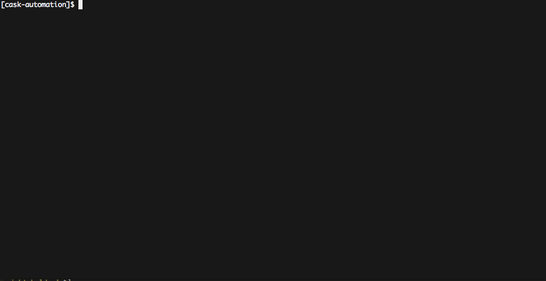

# cask-automation
Personal project for detecting new binaries for the folks at homebrew-cask

# usage
`$ python scan.py`

In Python 3 with some things on the blacklist, it usually takes about 180s (3m) to run through ~4000 casks.

If there are casks you want ignored, add them to the `blacklist.txt` file. Just add the cask name, not the filename.
